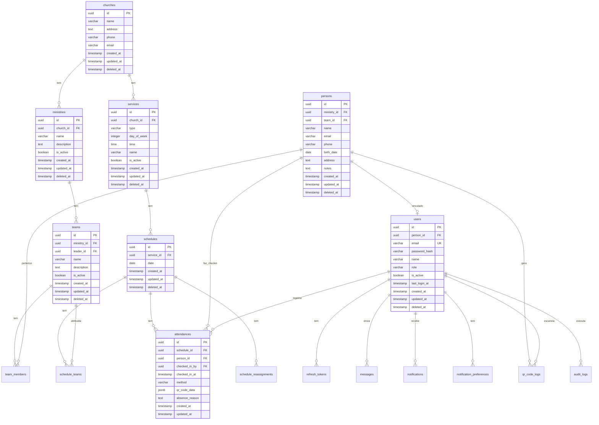

# Schema do Banco de Dados PostgreSQL - MINC Teams

## 📋 Visão Geral

Este documento descreve completamente o schema do banco de dados PostgreSQL para o sistema MINC Teams. Ele contém todas as tabelas, campos, relacionamentos, constraints, índices e estratégias de migrations necessárias para implementação.

**Versão**: 1.0.0  
**Última atualização**: 2025-01-04  
**Banco de Dados**: PostgreSQL 14+

---

## 🗺️ Diagrama de Entidade-Relacionamento



---

## 📊 Tabelas Principais

### 1. Autenticação e Usuários

#### 1.1. `users` - Usuários do Sistema

Armazena os usuários do sistema com suas credenciais e papéis.

```sql
CREATE TABLE users (
  id UUID PRIMARY KEY DEFAULT gen_random_uuid(),
  person_id UUID REFERENCES persons(id) ON DELETE SET NULL,
  email VARCHAR(255) NOT NULL UNIQUE,
  password_hash VARCHAR(255) NOT NULL,
  name VARCHAR(255) NOT NULL,
  role VARCHAR(20) NOT NULL CHECK (role IN ('admin', 'coordinator', 'leader', 'member')),
  is_active BOOLEAN NOT NULL DEFAULT true,
  last_login_at TIMESTAMP,
  created_at TIMESTAMP NOT NULL DEFAULT NOW(),
  updated_at TIMESTAMP NOT NULL DEFAULT NOW(),
  deleted_at TIMESTAMP,
  
  CONSTRAINT fk_user_person FOREIGN KEY (person_id) REFERENCES persons(id) ON DELETE SET NULL
);

CREATE INDEX idx_users_email ON users(email) WHERE deleted_at IS NULL;
CREATE INDEX idx_users_person_id ON users(person_id) WHERE deleted_at IS NULL;
CREATE INDEX idx_users_role ON users(role) WHERE deleted_at IS NULL;
CREATE INDEX idx_users_deleted_at ON users(deleted_at) WHERE deleted_at IS NULL;
```

**Campos:**
- `id`: UUID único do usuário
- `person_id`: Referência opcional ao servo/pessoa vinculado
- `email`: Email único do usuário (usado para login)
- `password_hash`: Hash da senha (bcrypt)
- `name`: Nome completo do usuário
- `role`: Papel do usuário (admin, coordinator, leader, member)
- `is_active`: Se o usuário está ativo
- `last_login_at`: Data/hora do último login
- `created_at`: Data de criação
- `updated_at`: Data de última atualização
- `deleted_at`: Soft delete

#### 1.2. `refresh_tokens` - Tokens de Refresh

Armazena tokens de refresh para renovação de autenticação JWT.

```sql
CREATE TABLE refresh_tokens (
  id UUID PRIMARY KEY DEFAULT gen_random_uuid(),
  user_id UUID NOT NULL REFERENCES users(id) ON DELETE CASCADE,
  token VARCHAR(500) NOT NULL UNIQUE,
  expires_at TIMESTAMP NOT NULL,
  is_revoked BOOLEAN NOT NULL DEFAULT false,
  created_at TIMESTAMP NOT NULL DEFAULT NOW(),
  
  CONSTRAINT fk_refresh_token_user FOREIGN KEY (user_id) REFERENCES users(id) ON DELETE CASCADE
);

CREATE INDEX idx_refresh_tokens_user_id ON refresh_tokens(user_id);
CREATE INDEX idx_refresh_tokens_token ON refresh_tokens(token);
CREATE INDEX idx_refresh_tokens_expires_at ON refresh_tokens(expires_at);
```

**Campos:**
- `id`: UUID único do token
- `user_id`: Referência ao usuário
- `token`: Token de refresh (hasheado)
- `expires_at`: Data de expiração
- `is_revoked`: Se o token foi revogado
- `created_at`: Data de criação

#### 1.3. `password_reset_tokens` - Tokens de Recuperação de Senha

Armazena tokens temporários para recuperação de senha.

```sql
CREATE TABLE password_reset_tokens (
  id UUID PRIMARY KEY DEFAULT gen_random_uuid(),
  user_id UUID NOT NULL REFERENCES users(id) ON DELETE CASCADE,
  token VARCHAR(255) NOT NULL UNIQUE,
  expires_at TIMESTAMP NOT NULL,
  used_at TIMESTAMP,
  created_at TIMESTAMP NOT NULL DEFAULT NOW(),
  
  CONSTRAINT fk_password_reset_user FOREIGN KEY (user_id) REFERENCES users(id) ON DELETE CASCADE
);

CREATE INDEX idx_password_reset_tokens_user_id ON password_reset_tokens(user_id);
CREATE INDEX idx_password_reset_tokens_token ON password_reset_tokens(token);
CREATE INDEX idx_password_reset_tokens_expires_at ON password_reset_tokens(expires_at);
```

---

### 2. Hierarquia Organizacional

#### 2.1. `churches` - Igrejas

Armazena as igrejas do sistema.

```sql
CREATE TABLE churches (
  id UUID PRIMARY KEY DEFAULT gen_random_uuid(),
  name VARCHAR(255) NOT NULL,
  address TEXT,
  phone VARCHAR(20),
  email VARCHAR(255),
  created_at TIMESTAMP NOT NULL DEFAULT NOW(),
  updated_at TIMESTAMP NOT NULL DEFAULT NOW(),
  deleted_at TIMESTAMP
);

CREATE INDEX idx_churches_name ON churches(name) WHERE deleted_at IS NULL;
CREATE INDEX idx_churches_deleted_at ON churches(deleted_at) WHERE deleted_at IS NULL;
```

**Campos:**
- `id`: UUID único da igreja
- `name`: Nome da igreja
- `address`: Endereço completo
- `phone`: Telefone de contato
- `email`: Email de contato
- `created_at`: Data de criação
- `updated_at`: Data de última atualização
- `deleted_at`: Soft delete

#### 2.2. `ministries` - Times/Ministérios

Armazena os ministérios/times de cada igreja.

```sql
CREATE TABLE ministries (
  id UUID PRIMARY KEY DEFAULT gen_random_uuid(),
  church_id UUID NOT NULL REFERENCES churches(id) ON DELETE CASCADE,
  name VARCHAR(255) NOT NULL,
  description TEXT,
  is_active BOOLEAN NOT NULL DEFAULT true,
  created_at TIMESTAMP NOT NULL DEFAULT NOW(),
  updated_at TIMESTAMP NOT NULL DEFAULT NOW(),
  deleted_at TIMESTAMP,
  
  CONSTRAINT fk_ministry_church FOREIGN KEY (church_id) REFERENCES churches(id) ON DELETE CASCADE
);

CREATE INDEX idx_ministries_church_id ON ministries(church_id) WHERE deleted_at IS NULL;
CREATE INDEX idx_ministries_name ON ministries(name) WHERE deleted_at IS NULL;
CREATE INDEX idx_ministries_is_active ON ministries(is_active) WHERE deleted_at IS NULL;
CREATE INDEX idx_ministries_deleted_at ON ministries(deleted_at) WHERE deleted_at IS NULL;
```

**Campos:**
- `id`: UUID único do ministério
- `church_id`: Referência à igreja
- `name`: Nome do ministério
- `description`: Descrição do ministério
- `is_active`: Se o ministério está ativo
- `created_at`: Data de criação
- `updated_at`: Data de última atualização
- `deleted_at`: Soft delete

#### 2.3. `teams` - Equipes

Armazena as equipes de cada ministério.

```sql
CREATE TABLE teams (
  id UUID PRIMARY KEY DEFAULT gen_random_uuid(),
  ministry_id UUID NOT NULL REFERENCES ministries(id) ON DELETE CASCADE,
  leader_id UUID REFERENCES users(id) ON DELETE SET NULL,
  name VARCHAR(255) NOT NULL,
  description TEXT,
  is_active BOOLEAN NOT NULL DEFAULT true,
  created_at TIMESTAMP NOT NULL DEFAULT NOW(),
  updated_at TIMESTAMP NOT NULL DEFAULT NOW(),
  deleted_at TIMESTAMP,
  
  CONSTRAINT fk_team_ministry FOREIGN KEY (ministry_id) REFERENCES ministries(id) ON DELETE CASCADE,
  CONSTRAINT fk_team_leader FOREIGN KEY (leader_id) REFERENCES users(id) ON DELETE SET NULL
);

CREATE INDEX idx_teams_ministry_id ON teams(ministry_id) WHERE deleted_at IS NULL;
CREATE INDEX idx_teams_leader_id ON teams(leader_id) WHERE deleted_at IS NULL;
CREATE INDEX idx_teams_name ON teams(name) WHERE deleted_at IS NULL;
CREATE INDEX idx_teams_is_active ON teams(is_active) WHERE deleted_at IS NULL;
CREATE INDEX idx_teams_deleted_at ON teams(deleted_at) WHERE deleted_at IS NULL;
```

**Campos:**
- `id`: UUID único da equipe
- `ministry_id`: Referência ao ministério
- `leader_id`: Referência ao líder da equipe (usuário)
- `name`: Nome da equipe
- `description`: Descrição da equipe
- `is_active`: Se a equipe está ativa
- `created_at`: Data de criação
- `updated_at`: Data de última atualização
- `deleted_at`: Soft delete

#### 2.4. `persons` - Servos/Pessoas

Armazena os servos/pessoas do sistema.

```sql
CREATE TABLE persons (
  id UUID PRIMARY KEY DEFAULT gen_random_uuid(),
  ministry_id UUID REFERENCES ministries(id) ON DELETE SET NULL,
  team_id UUID REFERENCES teams(id) ON DELETE SET NULL,
  name VARCHAR(255) NOT NULL,
  email VARCHAR(255),
  phone VARCHAR(20),
  birth_date DATE,
  address TEXT,
  notes TEXT,
  created_at TIMESTAMP NOT NULL DEFAULT NOW(),
  updated_at TIMESTAMP NOT NULL DEFAULT NOW(),
  deleted_at TIMESTAMP,
  
  CONSTRAINT fk_person_ministry FOREIGN KEY (ministry_id) REFERENCES ministries(id) ON DELETE SET NULL,
  CONSTRAINT fk_person_team FOREIGN KEY (team_id) REFERENCES teams(id) ON DELETE SET NULL
);

CREATE INDEX idx_persons_ministry_id ON persons(ministry_id) WHERE deleted_at IS NULL;
CREATE INDEX idx_persons_team_id ON persons(team_id) WHERE deleted_at IS NULL;
CREATE INDEX idx_persons_name ON persons(name) WHERE deleted_at IS NULL;
CREATE INDEX idx_persons_email ON persons(email) WHERE deleted_at IS NULL;
CREATE INDEX idx_persons_deleted_at ON persons(deleted_at) WHERE deleted_at IS NULL;
```

**Campos:**
- `id`: UUID único da pessoa
- `ministry_id`: Referência ao ministério (opcional)
- `team_id`: Referência à equipe (opcional)
- `name`: Nome completo
- `email`: Email de contato
- `phone`: Telefone de contato
- `birth_date`: Data de nascimento
- `address`: Endereço completo
- `notes`: Observações gerais
- `created_at`: Data de criação
- `updated_at`: Data de última atualização
- `deleted_at`: Soft delete

#### 2.5. `team_members` - Membros das Equipes (N:N)

Tabela de relacionamento N:N entre equipes e pessoas.

```sql
CREATE TABLE team_members (
  id UUID PRIMARY KEY DEFAULT gen_random_uuid(),
  team_id UUID NOT NULL REFERENCES teams(id) ON DELETE CASCADE,
  person_id UUID NOT NULL REFERENCES persons(id) ON DELETE CASCADE,
  created_at TIMESTAMP NOT NULL DEFAULT NOW(),
  
  CONSTRAINT fk_team_member_team FOREIGN KEY (team_id) REFERENCES teams(id) ON DELETE CASCADE,
  CONSTRAINT fk_team_member_person FOREIGN KEY (person_id) REFERENCES persons(id) ON DELETE CASCADE,
  CONSTRAINT uk_team_member UNIQUE (team_id, person_id)
);

CREATE INDEX idx_team_members_team_id ON team_members(team_id);
CREATE INDEX idx_team_members_person_id ON team_members(person_id);
```

**Campos:**
- `id`: UUID único do relacionamento
- `team_id`: Referência à equipe
- `person_id`: Referência à pessoa
- `created_at`: Data de criação

---

### 3. Cultos e Escalas

#### 3.1. `services` - Cultos/Serviços

Armazena os cultos/serviços de cada igreja.

```sql
CREATE TYPE service_type AS ENUM (
  'sunday_morning',
  'sunday_evening',
  'wednesday',
  'friday',
  'special'
);

CREATE TABLE services (
  id UUID PRIMARY KEY DEFAULT gen_random_uuid(),
  church_id UUID NOT NULL REFERENCES churches(id) ON DELETE CASCADE,
  type service_type NOT NULL,
  day_of_week INTEGER NOT NULL CHECK (day_of_week >= 0 AND day_of_week <= 6),
  time TIME NOT NULL,
  name VARCHAR(255) NOT NULL,
  is_active BOOLEAN NOT NULL DEFAULT true,
  created_at TIMESTAMP NOT NULL DEFAULT NOW(),
  updated_at TIMESTAMP NOT NULL DEFAULT NOW(),
  deleted_at TIMESTAMP,
  
  CONSTRAINT fk_service_church FOREIGN KEY (church_id) REFERENCES churches(id) ON DELETE CASCADE
);

CREATE INDEX idx_services_church_id ON services(church_id) WHERE deleted_at IS NULL;
CREATE INDEX idx_services_type ON services(type) WHERE deleted_at IS NULL;
CREATE INDEX idx_services_day_of_week ON services(day_of_week) WHERE deleted_at IS NULL;
CREATE INDEX idx_services_is_active ON services(is_active) WHERE deleted_at IS NULL;
CREATE INDEX idx_services_deleted_at ON services(deleted_at) WHERE deleted_at IS NULL;
```

**Campos:**
- `id`: UUID único do culto
- `church_id`: Referência à igreja
- `type`: Tipo de culto (enum)
- `day_of_week`: Dia da semana (0=Domingo, 6=Sábado)
- `time`: Horário do culto
- `name`: Nome do culto
- `is_active`: Se o culto está ativo
- `created_at`: Data de criação
- `updated_at`: Data de última atualização
- `deleted_at`: Soft delete

#### 3.2. `schedules` - Escalas

Armazena as escalas de cultos.

```sql
CREATE TABLE schedules (
  id UUID PRIMARY KEY DEFAULT gen_random_uuid(),
  service_id UUID NOT NULL REFERENCES services(id) ON DELETE CASCADE,
  date DATE NOT NULL,
  created_at TIMESTAMP NOT NULL DEFAULT NOW(),
  updated_at TIMESTAMP NOT NULL DEFAULT NOW(),
  deleted_at TIMESTAMP,
  
  CONSTRAINT fk_schedule_service FOREIGN KEY (service_id) REFERENCES services(id) ON DELETE CASCADE,
  CONSTRAINT uk_schedule_service_date UNIQUE (service_id, date) WHERE deleted_at IS NULL
);

CREATE INDEX idx_schedules_service_id ON schedules(service_id) WHERE deleted_at IS NULL;
CREATE INDEX idx_schedules_date ON schedules(date) WHERE deleted_at IS NULL;
CREATE INDEX idx_schedules_deleted_at ON schedules(deleted_at) WHERE deleted_at IS NULL;
```

**Campos:**
- `id`: UUID único da escala
- `service_id`: Referência ao culto
- `date`: Data da escala
- `created_at`: Data de criação
- `updated_at`: Data de última atualização
- `deleted_at`: Soft delete

#### 3.3. `schedule_teams` - Equipes Atribuídas às Escalas (N:N)

Tabela de relacionamento N:N entre escalas e equipes.

```sql
CREATE TABLE schedule_teams (
  id UUID PRIMARY KEY DEFAULT gen_random_uuid(),
  schedule_id UUID NOT NULL REFERENCES schedules(id) ON DELETE CASCADE,
  team_id UUID NOT NULL REFERENCES teams(id) ON DELETE CASCADE,
  created_at TIMESTAMP NOT NULL DEFAULT NOW(),
  
  CONSTRAINT fk_schedule_team_schedule FOREIGN KEY (schedule_id) REFERENCES schedules(id) ON DELETE CASCADE,
  CONSTRAINT fk_schedule_team_team FOREIGN KEY (team_id) REFERENCES teams(id) ON DELETE CASCADE,
  CONSTRAINT uk_schedule_team UNIQUE (schedule_id, team_id)
);

CREATE INDEX idx_schedule_teams_schedule_id ON schedule_teams(schedule_id);
CREATE INDEX idx_schedule_teams_team_id ON schedule_teams(team_id);
```

**Campos:**
- `id`: UUID único do relacionamento
- `schedule_id`: Referência à escala
- `team_id`: Referência à equipe
- `created_at`: Data de criação

#### 3.4. `attendances` - Check-ins/Presenças

Armazena os check-ins dos servos nas escalas.

```sql
CREATE TYPE attendance_method AS ENUM ('qr_code', 'manual');

CREATE TABLE attendances (
  id UUID PRIMARY KEY DEFAULT gen_random_uuid(),
  schedule_id UUID NOT NULL REFERENCES schedules(id) ON DELETE CASCADE,
  person_id UUID NOT NULL REFERENCES persons(id) ON DELETE CASCADE,
  checked_in_by UUID NOT NULL REFERENCES users(id) ON DELETE RESTRICT,
  checked_in_at TIMESTAMP NOT NULL DEFAULT NOW(),
  method attendance_method NOT NULL,
  qr_code_data JSONB,
  absence_reason TEXT,
  created_at TIMESTAMP NOT NULL DEFAULT NOW(),
  updated_at TIMESTAMP NOT NULL DEFAULT NOW(),
  
  CONSTRAINT fk_attendance_schedule FOREIGN KEY (schedule_id) REFERENCES schedules(id) ON DELETE CASCADE,
  CONSTRAINT fk_attendance_person FOREIGN KEY (person_id) REFERENCES persons(id) ON DELETE CASCADE,
  CONSTRAINT fk_attendance_checked_by FOREIGN KEY (checked_in_by) REFERENCES users(id) ON DELETE RESTRICT,
  CONSTRAINT uk_attendance_schedule_person UNIQUE (schedule_id, person_id)
);

CREATE INDEX idx_attendances_schedule_id ON attendances(schedule_id);
CREATE INDEX idx_attendances_person_id ON attendances(person_id);
CREATE INDEX idx_attendances_checked_in_by ON attendances(checked_in_by);
CREATE INDEX idx_attendances_checked_in_at ON attendances(checked_in_at);
CREATE INDEX idx_attendances_method ON attendances(method);
```

**Campos:**
- `id`: UUID único do check-in
- `schedule_id`: Referência à escala
- `person_id`: Referência ao servo que fez check-in
- `checked_in_by`: Referência ao usuário que registrou o check-in (líder)
- `checked_in_at`: Data/hora do check-in
- `method`: Método de check-in (qr_code ou manual)
- `qr_code_data`: Dados do QR Code usado (se método for qr_code)
- `absence_reason`: Justificativa de ausência (se não presente)
- `created_at`: Data de criação
- `updated_at`: Data de última atualização

#### 3.5. `schedule_reassignments` - Remanejamentos

Armazena o histórico de remanejamentos de servos entre equipes.

```sql
CREATE TABLE schedule_reassignments (
  id UUID PRIMARY KEY DEFAULT gen_random_uuid(),
  schedule_id UUID NOT NULL REFERENCES schedules(id) ON DELETE CASCADE,
  from_team_id UUID NOT NULL REFERENCES teams(id) ON DELETE RESTRICT,
  to_team_id UUID NOT NULL REFERENCES teams(id) ON DELETE RESTRICT,
  person_id UUID NOT NULL REFERENCES persons(id) ON DELETE CASCADE,
  reason TEXT,
  created_by UUID NOT NULL REFERENCES users(id) ON DELETE RESTRICT,
  created_at TIMESTAMP NOT NULL DEFAULT NOW(),
  
  CONSTRAINT fk_reassignment_schedule FOREIGN KEY (schedule_id) REFERENCES schedules(id) ON DELETE CASCADE,
  CONSTRAINT fk_reassignment_from_team FOREIGN KEY (from_team_id) REFERENCES teams(id) ON DELETE RESTRICT,
  CONSTRAINT fk_reassignment_to_team FOREIGN KEY (to_team_id) REFERENCES teams(id) ON DELETE RESTRICT,
  CONSTRAINT fk_reassignment_person FOREIGN KEY (person_id) REFERENCES persons(id) ON DELETE CASCADE,
  CONSTRAINT fk_reassignment_created_by FOREIGN KEY (created_by) REFERENCES users(id) ON DELETE RESTRICT
);

CREATE INDEX idx_schedule_reassignments_schedule_id ON schedule_reassignments(schedule_id);
CREATE INDEX idx_schedule_reassignments_person_id ON schedule_reassignments(person_id);
CREATE INDEX idx_schedule_reassignments_created_by ON schedule_reassignments(created_by);
CREATE INDEX idx_schedule_reassignments_created_at ON schedule_reassignments(created_at);
```

**Campos:**
- `id`: UUID único do remanejamento
- `schedule_id`: Referência à escala
- `from_team_id`: Equipe de origem
- `to_team_id`: Equipe de destino
- `person_id`: Servo remanejado
- `reason`: Motivo do remanejamento
- `created_by`: Usuário que fez o remanejamento
- `created_at`: Data de criação

---

### 4. QR Code e Check-in

#### 4.1. `qr_code_logs` - Logs de QR Code

Armazena logs de todas as tentativas de validação de QR Code para auditoria.

```sql
CREATE TABLE qr_code_logs (
  id UUID PRIMARY KEY DEFAULT gen_random_uuid(),
  person_id UUID NOT NULL REFERENCES persons(id) ON DELETE CASCADE,
  scanned_by UUID NOT NULL REFERENCES users(id) ON DELETE RESTRICT,
  qr_code_data JSONB NOT NULL,
  scanned_at TIMESTAMP NOT NULL DEFAULT NOW(),
  is_valid BOOLEAN NOT NULL,
  validation_error TEXT,
  created_at TIMESTAMP NOT NULL DEFAULT NOW(),
  
  CONSTRAINT fk_qr_log_person FOREIGN KEY (person_id) REFERENCES persons(id) ON DELETE CASCADE,
  CONSTRAINT fk_qr_log_scanned_by FOREIGN KEY (scanned_by) REFERENCES users(id) ON DELETE RESTRICT
);

CREATE INDEX idx_qr_code_logs_person_id ON qr_code_logs(person_id);
CREATE INDEX idx_qr_code_logs_scanned_by ON qr_code_logs(scanned_by);
CREATE INDEX idx_qr_code_logs_scanned_at ON qr_code_logs(scanned_at);
CREATE INDEX idx_qr_code_logs_is_valid ON qr_code_logs(is_valid);
```

**Campos:**
- `id`: UUID único do log
- `person_id`: Referência ao servo
- `scanned_by`: Usuário que escaneou o QR Code
- `qr_code_data`: Dados completos do QR Code escaneado
- `scanned_at`: Data/hora do escaneamento
- `is_valid`: Se a validação foi bem-sucedida
- `validation_error`: Mensagem de erro (se inválido)
- `created_at`: Data de criação

---

### 5. Comunicação

#### 5.1. `messages` - Mensagens

Armazena mensagens enviadas pelo sistema.

```sql
CREATE TYPE message_segment_type AS ENUM ('ministry', 'team', 'person', 'all');

CREATE TABLE messages (
  id UUID PRIMARY KEY DEFAULT gen_random_uuid(),
  sender_id UUID NOT NULL REFERENCES users(id) ON DELETE RESTRICT,
  title VARCHAR(255) NOT NULL,
  content TEXT NOT NULL,
  segment_type message_segment_type NOT NULL,
  segment_id UUID,
  scheduled_at TIMESTAMP,
  sent_at TIMESTAMP,
  created_at TIMESTAMP NOT NULL DEFAULT NOW(),
  
  CONSTRAINT fk_message_sender FOREIGN KEY (sender_id) REFERENCES users(id) ON DELETE RESTRICT
);

CREATE INDEX idx_messages_sender_id ON messages(sender_id);
CREATE INDEX idx_messages_segment_type ON messages(segment_type);
CREATE INDEX idx_messages_scheduled_at ON messages(scheduled_at);
CREATE INDEX idx_messages_sent_at ON messages(sent_at);
```

**Campos:**
- `id`: UUID único da mensagem
- `sender_id`: Usuário que enviou a mensagem
- `title`: Título da mensagem
- `content`: Conteúdo da mensagem
- `segment_type`: Tipo de segmento (ministry, team, person, all)
- `segment_id`: ID do segmento (ministry_id, team_id, person_id ou NULL)
- `scheduled_at`: Data/hora agendada para envio
- `sent_at`: Data/hora de envio efetivo
- `created_at`: Data de criação

#### 5.2. `message_recipients` - Destinatários das Mensagens

Armazena os destinatários de cada mensagem.

```sql
CREATE TABLE message_recipients (
  id UUID PRIMARY KEY DEFAULT gen_random_uuid(),
  message_id UUID NOT NULL REFERENCES messages(id) ON DELETE CASCADE,
  recipient_id UUID NOT NULL REFERENCES users(id) ON DELETE CASCADE,
  read_at TIMESTAMP,
  created_at TIMESTAMP NOT NULL DEFAULT NOW(),
  
  CONSTRAINT fk_message_recipient_message FOREIGN KEY (message_id) REFERENCES messages(id) ON DELETE CASCADE,
  CONSTRAINT fk_message_recipient_user FOREIGN KEY (recipient_id) REFERENCES users(id) ON DELETE CASCADE,
  CONSTRAINT uk_message_recipient UNIQUE (message_id, recipient_id)
);

CREATE INDEX idx_message_recipients_message_id ON message_recipients(message_id);
CREATE INDEX idx_message_recipients_recipient_id ON message_recipients(recipient_id);
CREATE INDEX idx_message_recipients_read_at ON message_recipients(read_at);
```

**Campos:**
- `id`: UUID único do relacionamento
- `message_id`: Referência à mensagem
- `recipient_id`: Referência ao destinatário (usuário)
- `read_at`: Data/hora de leitura
- `created_at`: Data de criação

#### 5.3. `notifications` - Notificações Push

Armazena notificações push enviadas.

```sql
CREATE TABLE notifications (
  id UUID PRIMARY KEY DEFAULT gen_random_uuid(),
  user_id UUID NOT NULL REFERENCES users(id) ON DELETE CASCADE,
  title VARCHAR(255) NOT NULL,
  body TEXT NOT NULL,
  type VARCHAR(50) NOT NULL,
  data JSONB,
  read_at TIMESTAMP,
  created_at TIMESTAMP NOT NULL DEFAULT NOW(),
  
  CONSTRAINT fk_notification_user FOREIGN KEY (user_id) REFERENCES users(id) ON DELETE CASCADE
);

CREATE INDEX idx_notifications_user_id ON notifications(user_id);
CREATE INDEX idx_notifications_type ON notifications(type);
CREATE INDEX idx_notifications_read_at ON notifications(read_at);
CREATE INDEX idx_notifications_created_at ON notifications(created_at);
```

**Campos:**
- `id`: UUID único da notificação
- `user_id`: Referência ao usuário destinatário
- `title`: Título da notificação
- `body`: Corpo da notificação
- `type`: Tipo da notificação
- `data`: Dados adicionais (JSONB)
- `read_at`: Data/hora de leitura
- `created_at`: Data de criação

#### 5.4. `notification_preferences` - Preferências de Notificação

Armazena preferências de notificação por usuário.

```sql
CREATE TABLE notification_preferences (
  id UUID PRIMARY KEY DEFAULT gen_random_uuid(),
  user_id UUID NOT NULL REFERENCES users(id) ON DELETE CASCADE,
  schedule_reminder BOOLEAN NOT NULL DEFAULT true,
  check_in_reminder BOOLEAN NOT NULL DEFAULT true,
  reassignment_notification BOOLEAN NOT NULL DEFAULT true,
  message_notification BOOLEAN NOT NULL DEFAULT true,
  created_at TIMESTAMP NOT NULL DEFAULT NOW(),
  updated_at TIMESTAMP NOT NULL DEFAULT NOW(),
  
  CONSTRAINT fk_notification_preference_user FOREIGN KEY (user_id) REFERENCES users(id) ON DELETE CASCADE,
  CONSTRAINT uk_notification_preference_user UNIQUE (user_id)
);

CREATE INDEX idx_notification_preferences_user_id ON notification_preferences(user_id);
```

**Campos:**
- `id`: UUID único da preferência
- `user_id`: Referência ao usuário
- `schedule_reminder`: Receber lembretes de escala
- `check_in_reminder`: Receber lembretes de check-in
- `reassignment_notification`: Receber notificações de remanejamento
- `message_notification`: Receber notificações de mensagens
- `created_at`: Data de criação
- `updated_at`: Data de última atualização

---

### 6. Auditoria e Logs

#### 6.1. `audit_logs` - Logs de Auditoria

Armazena logs de ações críticas para auditoria e compliance.

```sql
CREATE TYPE audit_action AS ENUM (
  'create',
  'update',
  'delete',
  'login',
  'logout',
  'password_change',
  'role_change',
  'reassignment',
  'check_in',
  'schedule_draw'
);

CREATE TABLE audit_logs (
  id UUID PRIMARY KEY DEFAULT gen_random_uuid(),
  user_id UUID REFERENCES users(id) ON DELETE SET NULL,
  action audit_action NOT NULL,
  entity_type VARCHAR(50) NOT NULL,
  entity_id UUID,
  old_values JSONB,
  new_values JSONB,
  ip_address VARCHAR(45),
  user_agent TEXT,
  created_at TIMESTAMP NOT NULL DEFAULT NOW(),
  
  CONSTRAINT fk_audit_log_user FOREIGN KEY (user_id) REFERENCES users(id) ON DELETE SET NULL
);

CREATE INDEX idx_audit_logs_user_id ON audit_logs(user_id);
CREATE INDEX idx_audit_logs_action ON audit_logs(action);
CREATE INDEX idx_audit_logs_entity_type ON audit_logs(entity_type);
CREATE INDEX idx_audit_logs_entity_id ON audit_logs(entity_id);
CREATE INDEX idx_audit_logs_created_at ON audit_logs(created_at);
```

**Campos:**
- `id`: UUID único do log
- `user_id`: Usuário que executou a ação
- `action`: Tipo de ação executada
- `entity_type`: Tipo da entidade afetada
- `entity_id`: ID da entidade afetada
- `old_values`: Valores antigos (JSONB)
- `new_values`: Valores novos (JSONB)
- `ip_address`: IP de origem
- `user_agent`: User agent do navegador
- `created_at`: Data de criação

#### 6.2. `draw_history` - Histórico de Sorteios

Armazena histórico de sorteios automáticos de equipes.

```sql
CREATE TABLE draw_history (
  id UUID PRIMARY KEY DEFAULT gen_random_uuid(),
  service_id UUID NOT NULL REFERENCES services(id) ON DELETE CASCADE,
  month INTEGER NOT NULL CHECK (month >= 1 AND month <= 12),
  year INTEGER NOT NULL CHECK (year >= 2020),
  drawn_by UUID NOT NULL REFERENCES users(id) ON DELETE RESTRICT,
  teams_data JSONB NOT NULL,
  created_at TIMESTAMP NOT NULL DEFAULT NOW(),
  
  CONSTRAINT fk_draw_history_service FOREIGN KEY (service_id) REFERENCES services(id) ON DELETE CASCADE,
  CONSTRAINT fk_draw_history_drawn_by FOREIGN KEY (drawn_by) REFERENCES users(id) ON DELETE RESTRICT,
  CONSTRAINT uk_draw_history_service_month_year UNIQUE (service_id, month, year)
);

CREATE INDEX idx_draw_history_service_id ON draw_history(service_id);
CREATE INDEX idx_draw_history_month_year ON draw_history(year, month);
CREATE INDEX idx_draw_history_drawn_by ON draw_history(drawn_by);
CREATE INDEX idx_draw_history_created_at ON draw_history(created_at);
```

**Campos:**
- `id`: UUID único do sorteio
- `service_id`: Referência ao culto
- `month`: Mês do sorteio (1-12)
- `year`: Ano do sorteio
- `drawn_by`: Usuário que executou o sorteio
- `teams_data`: Dados das equipes sorteadas (JSONB)
- `created_at`: Data de criação

---

## 🔄 Triggers

### Trigger para `updated_at` Automático

Criar função para atualizar `updated_at` automaticamente:

```sql
CREATE OR REPLACE FUNCTION update_updated_at_column()
RETURNS TRIGGER AS $$
BEGIN
  NEW.updated_at = NOW();
  RETURN NEW;
END;
$$ LANGUAGE plpgsql;
```

Aplicar trigger em todas as tabelas com `updated_at`:

```sql
-- Exemplo para tabela users
CREATE TRIGGER update_users_updated_at
  BEFORE UPDATE ON users
  FOR EACH ROW
  EXECUTE FUNCTION update_updated_at_column();

-- Aplicar para todas as outras tabelas com updated_at
-- (churches, ministries, teams, persons, services, schedules, etc.)
```

---

## 📋 Ordem de Criação das Tabelas (Migrations)

A ordem de criação deve respeitar as dependências de foreign keys:

1. **churches** (sem dependências)
2. **ministries** (depende de churches)
3. **persons** (depende de ministries e teams, mas teams ainda não existe - criar depois)
4. **users** (depende de persons)
5. **teams** (depende de ministries e users)
6. **persons** (atualizar foreign keys para teams)
7. **team_members** (depende de teams e persons)
8. **services** (depende de churches)
9. **schedules** (depende de services)
10. **schedule_teams** (depende de schedules e teams)
11. **attendances** (depende de schedules, persons e users)
12. **schedule_reassignments** (depende de schedules, teams, persons e users)
13. **refresh_tokens** (depende de users)
14. **password_reset_tokens** (depende de users)
15. **messages** (depende de users)
16. **message_recipients** (depende de messages e users)
17. **notifications** (depende de users)
18. **notification_preferences** (depende de users)
19. **qr_code_logs** (depende de persons e users)
20. **audit_logs** (depende de users)
21. **draw_history** (depende de services e users)

---

## 🔍 Índices Adicionais para Performance

### Índices Compostos

```sql
-- Busca de pessoas por ministério e equipe
CREATE INDEX idx_persons_ministry_team ON persons(ministry_id, team_id) WHERE deleted_at IS NULL;

-- Busca de escalas por data e culto
CREATE INDEX idx_schedules_service_date ON schedules(service_id, date) WHERE deleted_at IS NULL;

-- Busca de check-ins por escala e pessoa
CREATE INDEX idx_attendances_schedule_person ON attendances(schedule_id, person_id);

-- Busca de mensagens não lidas
CREATE INDEX idx_message_recipients_unread ON message_recipients(message_id, recipient_id) WHERE read_at IS NULL;

-- Busca de notificações não lidas
CREATE INDEX idx_notifications_unread ON notifications(user_id, read_at) WHERE read_at IS NULL;
```

---

## 🔒 Considerações de Segurança

### Soft Delete

Todas as tabelas principais implementam soft delete através do campo `deleted_at`. Isso permite:
- Recuperação de dados acidentalmente deletados
- Auditoria completa
- Compliance com LGPD

### Criptografia

- Senhas devem ser hasheadas com bcrypt (salt rounds: 10)
- Tokens devem ser hasheados antes de armazenar
- Dados sensíveis em JSONB podem ser criptografados

### Validações

- Email deve ser único e válido
- Telefone deve seguir formato padrão
- Datas devem ser validadas
- Roles devem ser validados contra enum

---

## 📊 Política de Retenção de Dados (LGPD)

### Dados a Retener

- **Logs de auditoria**: 7 anos
- **Logs de QR Code**: 1 ano
- **Histórico de sorteios**: Indefinido
- **Mensagens**: 2 anos
- **Notificações**: 6 meses

### Exclusão de Dados

Implementar rotina de limpeza periódica:

```sql
-- Exemplo: Excluir logs de QR Code com mais de 1 ano
DELETE FROM qr_code_logs 
WHERE created_at < NOW() - INTERVAL '1 year';

-- Exemplo: Excluir notificações lidas com mais de 6 meses
DELETE FROM notifications 
WHERE read_at IS NOT NULL 
  AND read_at < NOW() - INTERVAL '6 months';
```

---

## 🚀 Próximos Passos

1. Criar migrations usando TypeORM ou similar
2. Implementar seeds para dados iniciais
3. Configurar backups automáticos
4. Implementar rotinas de limpeza de dados
5. Configurar monitoramento de performance
6. Documentar queries frequentes

---

## 📝 Notas Importantes

- Todos os IDs são UUIDs para melhor distribuição e segurança
- Timestamps usam TIMEZONE (TIMESTAMP WITH TIME ZONE) se necessário
- Índices parciais (WHERE deleted_at IS NULL) melhoram performance
- Constraints garantem integridade referencial
- Soft delete permite recuperação de dados

---

**Última atualização**: 2025-01-04  
**Versão do Schema**: 1.0.0
