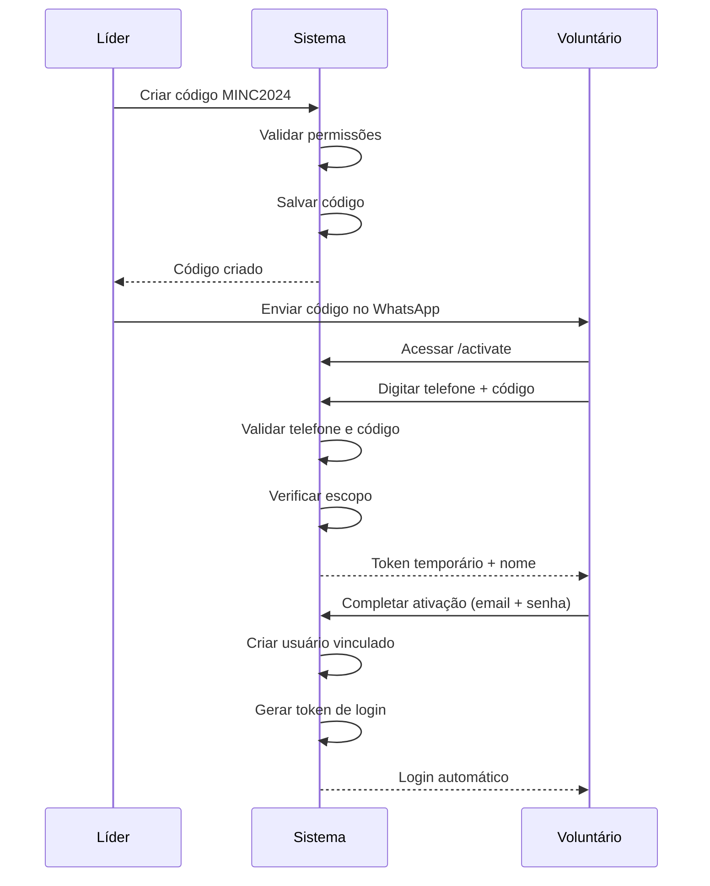

# Guia de Uso: Onboarding em Massa via Código de Acesso

## 📋 Visão Geral

Este sistema permite que líderes criem códigos de acesso compartilhados para ativar contas de voluntários em massa, eliminando a necessidade de SMS ou convites individuais.

## 👥 Para Líderes (Criar Códigos)

### Passo 1: Acessar a Página de Códigos de Acesso

1. Faça login no sistema
2. Navegue até **"Códigos de Acesso"** no menu (ou acesse `/access-codes`)
3. Você verá:
   - Lista de códigos criados por você
   - Estatísticas (códigos ativos, expirados, total de ativações)
   - Botão "Criar Novo Código"

### Passo 2: Criar um Código

1. Clique em **"Criar Novo Código"**
2. Preencha o formulário:
   - **Código**: Digite um código único (ex: `MINC2024`, `BOASVINDAS2024`)
     - Apenas letras maiúsculas e números
     - Mínimo 4 caracteres
   - **Tipo de Escopo**: Escolha entre:
     - **Igreja**: Código válido para toda a igreja
     - **Ministério**: Código válido para um ministério específico
     - **Time**: Código válido para um time específico
   - **Selecione o Escopo**: Escolha a igreja, ministério ou time conforme o tipo selecionado
   - **Dias de Validade**: Quantos dias o código ficará válido (padrão: 30 dias)
   - **Limite de Usos** (opcional): Quantas pessoas podem usar o código (deixe vazio para ilimitado)
3. Clique em **"Criar Código"**

### Passo 3: Divulgar o Código

1. Copie o código criado
2. Envie uma única mensagem no grupo do WhatsApp da igreja/time:
   ```
   Pessoal, nosso sistema está no ar! 🎉
   
   Para ativar sua conta:
   1. Acesse: [URL_DO_SISTEMA]/activate
   2. Digite seu telefone cadastrado
   3. Digite o código: MINC2024
   
   Qualquer dúvida, me chamem!
   ```

### Passo 4: Acompanhar Ativações

- Na página de Códigos de Acesso, você pode ver:
  - Quantas vezes cada código foi usado
  - Status (ativo/expirado/desativado)
  - Data de expiração
- Para desativar um código antes do prazo, clique em **"Desativar"**

## 👤 Para Voluntários (Ativar Conta)

### Passo 1: Acessar a Página de Ativação

1. Acesse: `[URL_DO_SISTEMA]/activate`
2. Você verá um formulário com dois campos:
   - Telefone
   - Código de Acesso

### Passo 2: Verificar Dados

1. Digite seu **telefone** (com DDD)
   - O sistema aplica máscara automaticamente
   - Exemplo: `(11) 98765-4321`
2. Digite o **código de acesso** fornecido pelo líder
   - Exemplo: `MINC2024`
   - O código é convertido automaticamente para maiúsculas
3. Clique em **"Verificar"**

### Passo 3: Completar Ativação

Se os dados estiverem corretos, você será redirecionado para a página de completar ativação:

1. Você verá: **"Olá, [Seu Nome]!"**
2. Preencha:
   - **Email**: Seu email pessoal (será usado para login)
   - **Senha**: Crie uma senha segura (mínimo 6 caracteres)
   - **Confirmar Senha**: Digite a senha novamente
3. Clique em **"Ativar Conta"**

### Passo 4: Login Automático

Após ativar, você será automaticamente logado e redirecionado para o dashboard!

## 🔐 Permissões

### Quem pode criar códigos?

- **Admin/Pastor**: Pode criar códigos para qualquer escopo (igreja, ministério ou time)
- **Líder de Ministério**: Pode criar códigos para:
  - Seu ministério
  - Times do seu ministério
- **Líder de Equipe**: Pode criar códigos apenas para seu time

## ⚠️ Validações e Regras

### Validações do Sistema

1. **Telefone deve existir na base de dados**
   - O telefone deve ter sido importado previamente
   - O formato é normalizado automaticamente

2. **Código deve estar válido**
   - Código existe
   - Código está ativo
   - Código não expirou
   - Código não atingiu limite de usos (se houver)

3. **Pessoa deve pertencer ao escopo**
   - Se o código é para um time, a pessoa deve estar vinculada a esse time
   - Se o código é para um ministério, a pessoa deve estar vinculada a esse ministério
   - Se o código é para uma igreja, a pessoa deve estar vinculada a algum ministério dessa igreja

4. **Pessoa não pode ter conta já ativada**
   - Se a pessoa já possui uma conta, será exibida mensagem de erro

5. **Email não pode estar em uso**
   - O email deve ser único no sistema

### Limites de Segurança

- **Rate Limiting**: Máximo 5 tentativas de ativação por minuto por IP
- **Token Temporário**: Válido por 24 horas após verificação
- **Token Single-Use**: Cada token só pode ser usado uma vez

## 📊 Exemplos de Uso

### Exemplo 1: Código para Time Específico

**Cenário**: Líder quer ativar apenas pessoas do "Time Boas-Vindas"

1. Criar código com:
   - Código: `BOASVINDAS2024`
   - Escopo: Time
   - Time: "Time Boas-Vindas"
   - Validade: 30 dias
   - Limite: Ilimitado

2. Divulgar apenas para membros do Time Boas-Vindas

### Exemplo 2: Código para Ministério

**Cenário**: Líder quer ativar todas as pessoas do Ministério de Música

1. Criar código com:
   - Código: `MUSICA2024`
   - Escopo: Ministério
   - Ministério: "Ministério de Música"
   - Validade: 60 dias
   - Limite: 100 usos

2. Divulgar para todos os membros do ministério

### Exemplo 3: Código para Igreja Inteira

**Cenário**: Pastor quer ativar todas as pessoas da igreja

1. Criar código com:
   - Código: `MINC2024`
   - Escopo: Igreja
   - Igreja: "Minha Igreja na Cidade"
   - Validade: 90 dias
   - Limite: Ilimitado

2. Divulgar para toda a igreja

## 🐛 Solução de Problemas

### "Telefone não encontrado na base de dados"

- Verifique se o telefone foi importado corretamente
- Confirme que o formato está correto (com DDD)
- Entre em contato com o líder para verificar se você está na lista

### "Código de acesso inválido"

- Verifique se digitou o código corretamente
- Confirme que o código não expirou
- Verifique se o código não foi desativado
- Entre em contato com o líder para obter um novo código

### "Você não pertence ao escopo deste código"

- O código foi criado para um escopo específico (time/ministério/igreja)
- Você precisa estar vinculado a esse escopo na base de dados
- Entre em contato com o líder para verificar seu vínculo

### "Esta pessoa já possui uma conta ativada"

- Você já ativou sua conta anteriormente
- Tente fazer login com seu email e senha
- Se esqueceu a senha, use a opção "Esqueci minha senha"

### "Email já está em uso"

- Este email já está cadastrado no sistema
- Tente usar outro email
- Se você já tem conta, faça login normalmente

## 📝 Notas Importantes

1. **Importação Prévia**: As pessoas precisam estar importadas na base de dados antes de usar o código
2. **Telefone Único**: Cada pessoa deve ter um telefone único cadastrado
3. **Código Case-Insensitive**: O código pode ser digitado em maiúsculas ou minúsculas
4. **Expiração Automática**: Códigos expiram automaticamente na data definida
5. **Desativação Manual**: Líderes podem desativar códigos a qualquer momento

## 🔄 Fluxo Completo



## 📞 Suporte

Em caso de dúvidas ou problemas:
1. Verifique este guia
2. Entre em contato com o líder do seu time/ministério
3. Entre em contato com o administrador do sistema
